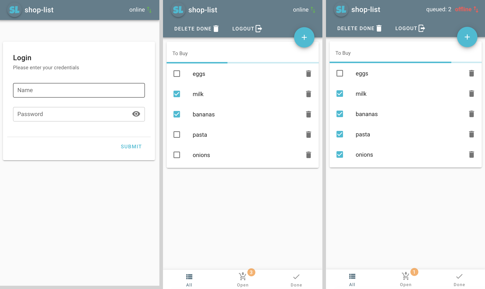

# shop-list

> Todo app on steroids! PWA with realtime messaging, offline support and more. Build with vue.js, express, socket.io & vuetify

A shopping list app, which is basically the same as a todo app.
This project was started in order to experiment with different technologies like socket.io & vuetify.

**The main features are**:

+ live updates to other users
+ offline support: changes get stored locally & pushed when online again
+ pwa, can be installed on all platforms & mobile devices
+ user login, authentication with jwt




**Techstack**:

+ [vue.js](https://vuejs.org/)
+ [vuex](https://vuex.vuejs.org/)
+ [vuetify](https://vuetifyjs.com/en/)
+ [axios](https://github.com/axios/axios)
+ [socket.io](https://socket.io/)
+ [express.js](https://expressjs.com)
+ [jwt](https://jwt.io/)


## Frontend setup
```
yarn install
```

### Compiles and hot-reloads for development
```
yarn serve
```
Starts dev server on `localhost:8080`, login credentials are (user1, secret1).

### Compiles and minifies for production
```
yarn build
```

### Lints and fixes files
```
yarn lint
```

### Customize configuration
See [Configuration Reference](https://cli.vuejs.org/config/).


## Backend Setup

```
cd webserver
# install node modules
npm install
# create keypair for jwt signing
make keypair
# start dev server (nodemon)
npm run dev
```

In dev mode some test data `test_data.json` will be loaded. The credentials can be changed in `user_data.json`.